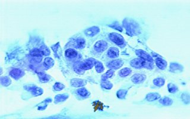
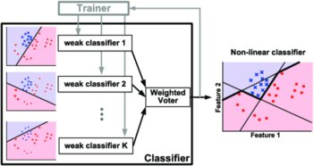
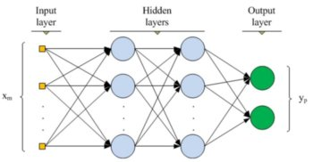

# Machine Learning Engineer Nanodegree
## Capstone Proposal
Ebrahim Jakoet

August 15th, 2019

## Proposal

### Domain Background

About 12% of women living in America will develop some form of invasive breast cancer.  It is estimated that 41,760 of women in the US will die from breast cancer in 2019.  Breast cancer remains among the most commonly diagnosed types of cancer in older women especially, and a leading cause of death compared to most other types of cancer _[1]_.  This is based on the latest available information on [BreastCancer.org](https://www.breastcancer.org/symptoms/understand_bc/statistics).

In this project we will use the Breast Cancer Wisconsin (Diagnostic) Data Set to build a model that can predict the presence of a malignant cancer based on the given features in the dataset.  We will also determine which features are more significant in the detection of malignant breast cancer.  The dataset is derived from digitized images of a fine needle aspirate (FNA) biopsy of breast mass samples. The features describe characteristics of the cell nuclei present in the image [^2].  Machine learning techniques have already been used in the diagnosis of breast cancer from Fine Needle Aspirates _[3][4]_.  Early detection of breast cancer can be life-saving and Machine Learning is increasingly being relied upon in early detection methods.  It is the real life-saving results using machine learning that draws me to the subject.

> Figure 1. A sample image of an FNA biopsy.

### Problem Statement

There are 30 feature measurements contained in the dataset with each sample labeled as either (M) Malignant or (B) Benign.  The goal is to determine which features are most significant and to build and compare an AdaBoost model and a DNN model that will be able to predict the malignancy of the FNA sample based on the given features.  The 2 models will be compared using standard evaluation metrics. 

### Datasets and Inputs

The data set was acquired from the Kaggle website [Breast Cancer Wisconsin (Diagnostic) Data Set](https://www.kaggle.com/uciml/breast-cancer-wisconsin-data) project.  It is also available from the [UCI Website Archive](https://archive.ics.uci.edu/ml/datasets/Breast+Cancer+Wisconsin+%28Diagnostic%29).  The data is also available from the following [ftp server](ftp://ftp.cs.wisc.edu/math-prog/cpo-dataset/machine-learn/cancer/) The data consists of a single file of interest of 32 columns and 569 sample instances.  Creators of the data set are listed below:

1. Dr. William H. Wolberg, General Surgery Dept.
University of Wisconsin, Clinical Sciences Center
Madison, WI 53792
wolberg '@' eagle.surgery.wisc.edu

2. W. Nick Street, Computer Sciences Dept.
University of Wisconsin, 1210 West Dayton St., Madison, WI 53706
street '@' cs.wisc.edu 608-262-6619

3. Olvi L. Mangasarian, Computer Sciences Dept.
University of Wisconsin, 1210 West Dayton St., Madison, WI 53706
olvi '@' cs.wisc.edu

The data consists of an ID column, a labeled target column that shows (M) for malignant or (B) for Benign and the following 10 features.

1. radius (mean of distances from center to points on the perimeter)
2. texture (standard deviation of gray-scale values)
3. perimeter
4. area
5. smoothness (local variation in radius lengths)
6. compactness (perimeter^2 / area - 1.0)
7. concavity (severity of concave portions of the contour)
8. concave points (number of concave portions of the contour)
9. symmetry
10. fractal dimension ("coastline approximation" - 1)

Each of these 10 features have a mean, standard error and worst or largest (mean of the three largest values) value which makes the total feature set 3 x 10 = 30 features in total.  Feature values have been recorded with 4 significant digits.

### Solution Statement

The solution involves the building of 2 competing models.  The first model will be an AdaBoost ensemble model and will be used as the benchmark model.  The second model will be a Deep Neural Network (DNN) built with the Keras modules for neural network architecture.  AdaBoost and neural network algorithms are popular algorithms in machine learning and have been compared in a number of studies before _[5][6]_.

Each model will produce an accuracy and recall score comparing the result of training and testing data using the following formulae:

`Accuracy = True Positives + True Negatives / Total number of Samples`

`Recall = True Positives / (False Negatives + True Positives)`

Since this is a test for the presence or absence of a malignant breast mass, the Recall evaluation metrics will also be relevant.

We will also compare the processing time for each learning algorithm.  Ideally, we are looking for a solution with high accuracy, but the lower processing time may be relevant if processing is a limiting factor for the actual deployment.

`Processing Time = Time elapsed between (Training start, Prediction end)`

### Benchmark Model

We will use the AdaBoost model as a benchmark model since we are comparing Adaboost to a DNN.  There are many hyper-parameters that can be set for the AdaBoost model.  For our model we will use the following setup, but these hyper-parameters will likely be changed to get the highest evaluation metrics possible.

1. base_estimator: DecisionTreeClassifier(max_depth=1)
2. n_estimators: 1000
3. learning_rate: 1.0
4. algorithm: SAMME.R
5. random_state: 19

### Evaluation Metrics

To compare the AdaBoost and DNN models, we will be using an accuracy score, recall and processing time.  Accuracy will give us a measure of how well the model is able to predict the correct outcome.  Recall is important because we want to be able to minimize the False Negatives since this is a test for the presence of cancer in a breast mass.  Processing time is only relevant if the deployment of the solution has limited resources.  It is always good to see how the 2 models compare in time.  The formulae for the accuracy and recall evaluation metrics are shown below.

`Accuracy = True Positives + True Negatives / Total number of Samples`

`Recall = True Positives / (False Negatives + True Positives)`

For processing time, we will use the python time modules to calculate time difference between the training start and stop of each of the 2 models.

`Processing Time = Time elapsed between (Training start, Prediction end)`

### Project Design

The workflow for this project can be broken down into the following sections:
- Importing the data
- Data exploration
- Feature selection and normalization
- Split into training and test data sets
- Build the benchmark AdaBoost model
- Build the DNN model
- Compare evaluation metrics

Each of these steps in the workflow will be discussed in more detail below.

#### Importing the Data

Since the original data file is in a compressed format, we will decompress the data file and then read it into a Pandas dataframe, using the variable `X` for the features and `y` for the labels.

#### Data Exploration

We will do some basic data exploration by checking for valid data, removing invalid on unnecessary data, generating some statistics on the features and plotting charts to show some of the characteristics of features. We will use the `seaborn` Statistical Data Validation toolset for all visualizations.

#### Feature Selection and Normalization

We will investigate the features, using the low variance method to see if there are any features with low variance that can be excluded.  We will use a Low Variance threshold value of `0.9 x (1 - 0.9)`. This will be stored in a variable called `Xv`.  Finally, we will create a normalized version of the feature set `Xn` using a MinMaxScaler.  The normalized version will be used in the DNN.

#### Split into Training and Test datasets

Using the `sklearn.model_selection.train_test_split()` module, we will split the data into a training set and a testing set. We will use 20% of the data for testing, 80% for training with the `shuffle` parameter set to true to ensure a good mix of malignant and benign samples in both training and testing data set.

#### Build the Benchmark Adaboost Model

We will build an AdaBoost Model as our benchmark model.  AdaBoost is a boosting method that uses a number of weak classifiers combined through a weighted voting scheme that is trained to produce the final result.  The Adaboost model will be built with the following hyperparameter settings:

1. base_estimator: DecisionTreeClassifier(max_depth=1)
2. n_estimators: 1000
3. learning_rate: 1.0
4. algorithm: SAMME.R
5. random_state: 19

After fitting the model to the training set, we will use it to predict the outcome on the test data set.  Thereafter we will calculate the following evaluation metrics:

1. Accuracy
2. Recall
3. Processing time for training and prediction.
3. Feature importance

> Figure 2. Illustration of AdaBoost Model.

#### Build the DNN Model

The competing model will be a Deep Neural Network.  We will build this model with Keras.  The model architecture will be the input layer, 2 hidden layers of 16 nodes each and relu activation functions and a dense layer for the output with softmax activation function.  The DNN model will use the `categorical_crossentropy` loss function with the `rmsprop` optimizer against the `accuracy` metric.  We will train the model using `batch_size` of 32 for 1000 epochs.

> Figure 3.  Illustration of DNN with 2 hidden layers.

#### Compare Evaluation Metrics

Once the both models have been trained and used to predict the outcomes on the test set, we will compare the results of the following metrics for each of the models.

1. Accuracy
2. Recall
3. Processing time for training and prediction.

Finally we will comment on the strengths and weaknesses of the competing models based on the results.

### References

- [1]: `https://www.breastcancer.org/symptoms/understand_bc/statistics`.

- [2]: W.N. Street, W.H. Wolberg and O.L*. Mangasarian. Nuclear feature extraction for breast tumor diagnosis. IS&T/SPIE 1993 International Symposium on Electronic Imaging: Science and Technology, volume 1905, pages 861-870, San Jose, CA, 1993.

- [3]: W.H. Wolberg, W.N. Street, and O.L. Mangasarian. Machine learning techniques to diagnose breast cancer from fine-needle aspirates. Cancer Letters 77 (1994) 163-171.

- [4]: W.H. Wolberg, W.N. Street, D.M. Heisey, and O.L. Mangasarian. Computerized breast cancer diagnosis and prognosis from fine needle aspirates. Archives of Surgery 1995;130:511-516.

- [5]: Samanta, B.*, Banopadhyay, S.**, Ganguli, R.** & Dutta, S. A comparative study of the performance of single neural network vs. Adaboost algorithm based combination of multiple neural networks for mineral resource estimation.  Journal of the Southern African Institute of Mining and Metallurgy, Volume 105, Number 4, 1 April 2005, pp. 237-246(10)

- [6]:  T. Windeatt, R.Ghaderi. AdaBoost and neural networks. ESANN'1999 proceedings - European Symposium on Artificial Neural Networks. Bruges (Belgium), 21-23 April 1999, D-Facto public., ISBN 2-600049-9-X, pp. 123-128
